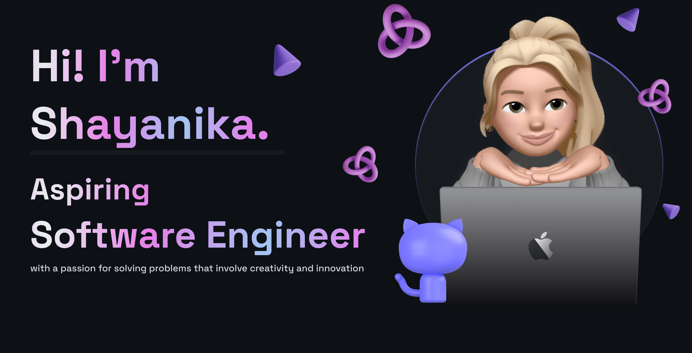

<p align="left">  </p>


```python
  class WhoAmI:
    user = 'shayanika23'
    current_edu = "unknown"
    currently_learning = "to live life"
    
    
	
	
	
 ```

- Reach me **shayanika23@gmail.com**


### Skills

<p align="left">
<a href="https://docs.microsoft.com/en-us/cpp/?view=msvc-170" target="_blank" rel="noreferrer"></a><a href="https://www.python.org/" target="_blank" rel="noreferrer"></a><a href="https://developer.mozilla.org/en-US/docs/Web/JavaScript" target="_blank" rel="noreferrer"></a><a href="https://git-scm.com/" target="_blank" rel="noreferrer"></a><a href="https://code.visualstudio.com/" target="_blank" rel="noreferrer"></a><a href="https://developer.mozilla.org/en-US/docs/Glossary/HTML5" target="_blank" rel="noreferrer"></a><a href="https://www.w3.org/TR/CSS/#css" target="_blank" rel="noreferrer"></a><a href="https://www.mysql.com/" target="_blank" rel="noreferrer"></a><a href="https://cloud.google.com/" target="_blank" rel="noreferrer"></a><a href="https://apple.com" target="_blank" rel="noreferrer"></a>
</p>

<h1>Stats:</h1>
<div align=center>

</div>
<div align=center>
&nbsp;
</div>
